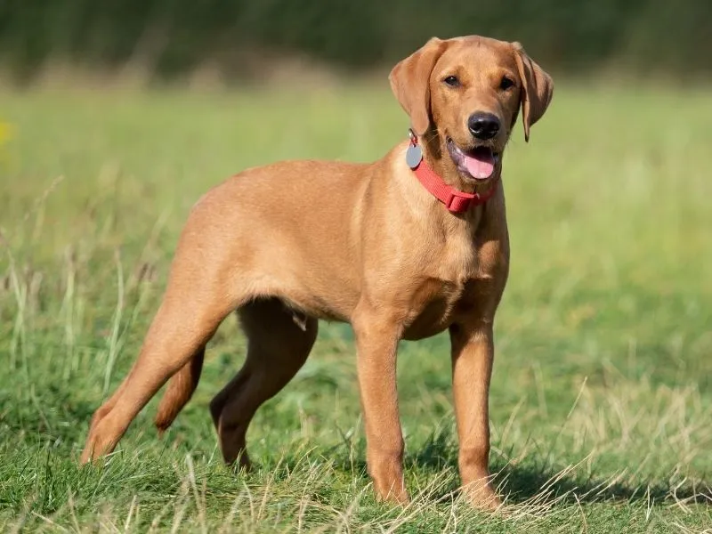
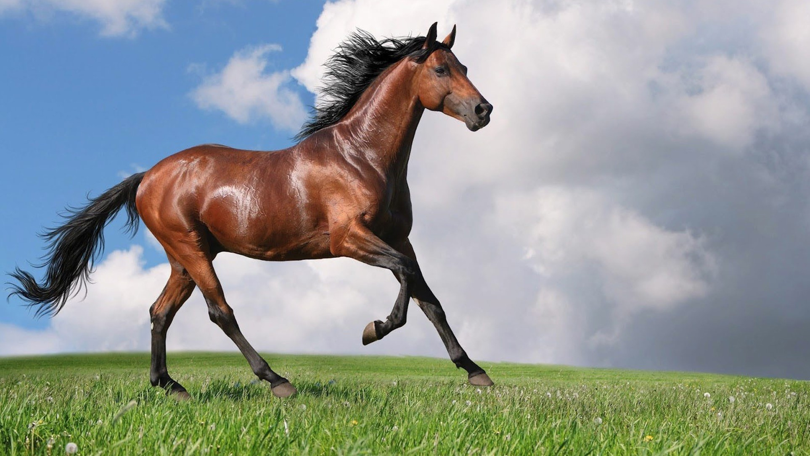
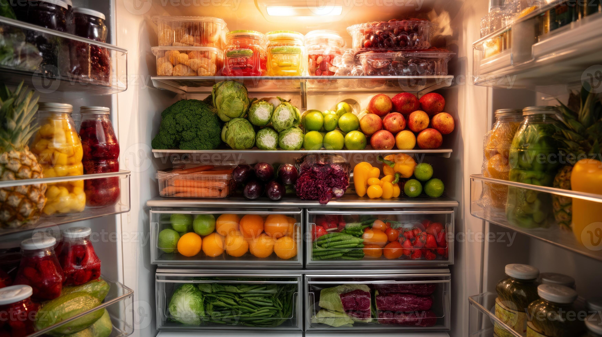
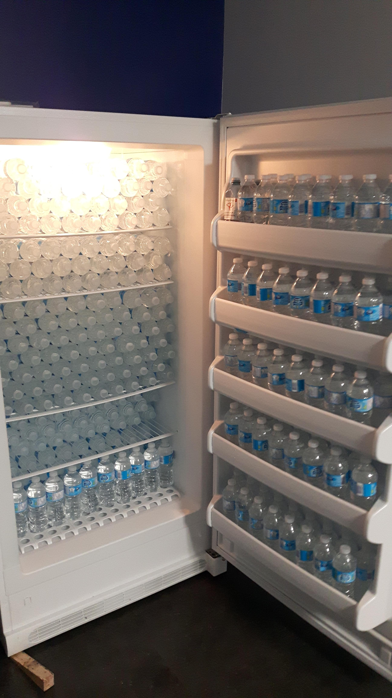
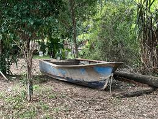
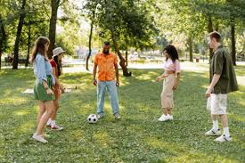

# Negation-Aware Image Retrieval

## 🚀 Overview

Modern vision-language models such as CLIP perform well on descriptive queries but often fail when handling **negation** (e.g., “an image of an animal that is not a dog”). These models tend to retrieve images matching dominant concepts rather than respecting logical constraints in language.

This project explores a **"Zero-shot"** method to enable **negation-aware image retrieval**, improving text-to-image search by correctly identifying and excluding negated concepts. 
- No changes to the encoder model (DistilBERT)
- No changes to CLIP

---
## 📊 Comparison: Standard CLIP vs Negation-Aware Retrieval

We compare standard CLIP retrieval with my negation-aware approach on queries involving negation.

---

### 🧪 Query 1
**Text:** *"an image of an animal that is not a dog"*

| Model | Retrieved Image |
|------|----------------|
| DeBERTa-V3-large + CLIP |  |
| DistilBERT + CLIP *(My Approach)* |  |

**Observation:**  
DeBERTa-V3-large + CLIP retrieves images of dogs despite the negation.  
DistilBERT + CLIP method correctly excludes dogs and retrieves other animals.

---

### 🧪 Query 2
**Text:** *"an image of a fridge without fruits"*

| Model | Retrieved Image |
|------|----------------|
| DeBERTa-V3-large + CLIP |  |
| DistilBERT + CLIP *(My Approach)* |  |

**Observation:**  
DeBERTa-V3-large + CLIP retrieves images containing fruits.  
DistilBERT + CLIP method retrieves a fridge without fruits, respecting the negation.

---

### 🧪 Query 3
**Text:** *"an image of a boat not in the ocean"*

| Model | Retrieved Image |
|------|----------------|
| DeBERTa-V3-large + CLIP |  |
| DistilBERT + CLIP *(My Approach)* |  |

**Observation:**  
DeBERTa-V3-large + CLIP prioritizes dominant associations (boat → ocean).  
DistilBERT + CLIP method retrieves boats in alternative contexts.

---

### 🧪 Query 4
**Text:** *"an image of people playing in a park not children"*

| Model | Retrieved Image |
|------|----------------|
| DeBERTa-V3-large + CLIP |  |
| DistilBERT + CLIP *(My Approach)* |  |

**Observation:**  
DeBERTa-V3-large + CLIP retrieves children playing.  
DistilBERT + CLIP method correctly retrieves adults.

---

### 🧪 Query 5
**Text:** *"an image of people playing in a park not adults"*

| Model | Retrieved Image |
|------|----------------|
| DeBERTa-V3-large + CLIP |  |
| DistilBERT + CLIP *(My Approach)* |  |

**Observation:**  
DeBERTa-V3-large + CLIP retrieves adults playing as CLIP just sees adults.  
DistilBERT + CLIP method correctly retrieves children.

---

## 📌 Summary

- Standard CLIP struggles with **negation and compositional constraints**
- My approach improves retrieval by:
  - Identifying negated concepts  
  - Filtering or re-ranking results accordingly  

This leads to more **accurate and controllable text-to-image retrieval**.

---

## 🎯 Problem Statement

Given a natural language query containing negation:

> "an image of an animal not a dog"

Standard retrieval systems often return images **containing the negated concept**, indicating a lack of proper negation understanding.

The goal of this project is to:

- Identify the **negated concept** in a query  
- Retrieve images based on **positive concepts only**  
- Improve robustness of retrieval systems to **logical constraints in language**

---

## 🧠 Key Idea

Instead of relying on training or fine-tuning large models, this project investigates whether:

> **Negation signals already exist in pretrained language models and can be extracted in a zero-shot manner**

## 🔬 Results

- Successfully identifies negated concepts across:
  - Object-level queries  
  - Contextual negation  
  - Fine-grained semantic distinctions (e.g., adult vs child)

- Demonstrates strong performance compared to:
  - Large pretrained encoders (non-task-specific) -> Outperforms it
  - Supervised NLI models (as a reference baseline) -> Gives Similar results

- Improves retrieval quality in cases where standard CLIP fails

---

## ⚠️ Limitations

- Confidence degrades when negated concepts are expressed as **compositional phrases** (e.g., “basket on it”), but the output image is still correct.  
- Negation signals become less localized in longer or more complex sentences. 

---

## 🧪 Queries (Benchmarked on)
### 🟢 Category A: Object Negation (30)

a dog not on the grass
a cat without a collar
a car with no driver
a person not wearing glasses
a table without a book
a chair with no cushion
a street without cars
a beach with no people
a room without windows
a plate without food
a bike without a rider
a laptop without a keyboard
a phone without a case
a dog without a leash
a cat without a tail visible
a car without wheels visible
a person without shoes
a desk without a chair
a sofa without pillows
a kitchen without utensils
a park without benches
a road without traffic
a house without doors
a person without a hat
a cup without liquid
a bottle without a label
a bag without straps
a tree without leaves
a building without windows
a room without furniture

### 🟡 Category B: Attribute Negation (25)

### 🔵 Category C: Spatial Negation (25)

### 🔴 Category D: Compositional Negation (25)

### ⚫ Category E: Hard / Ambiguous (15)

- "an image of an animal that is not a dog"  
- "a fridge without fruits"  
- "a boat not in the ocean"  
- "people playing in a park not children"  

---

## 🛠️ Tech Stack

- Python  
- PyTorch  
- HuggingFace Transformers  
- CLIP (Vision-Language Model)  
 

---

## 🔮 Future Work

- Handle very complex sentences
- Extend to more complex compositional reasoning  
- Improve robustness to long-range dependencies  
- Evaluate on larger and standardized benchmarks  

---

## 📌 Note

Details of the underlying method will be added in a future after Benchmarks and Pre-print is ready.

